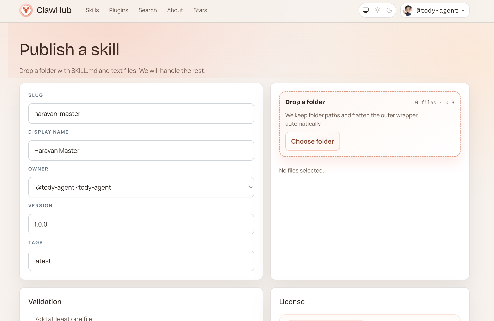

# Haravan Claw Master

**Haravan Claw Master** is the kit name (docs, skills, community) built on **OpenClaw** and **Haravan**. On OpenClaw/npm the plugin is still **Haravan Ops** — see the table below.

---

## Quick start (end users)

1. **OpenClaw (recommended)** — install the plugin, then configure `shop` + `accessToken`:
   ```bash
   openclaw plugins install @haravan-master/openclaw-haravan-ops-plugin
   ```
   If the package is not on npm yet, install from a local clone after `npm install && npm run build`:
   ```bash
   openclaw plugins install -l ./packages/openclaw-haravan-plugin
   ```
2. **MCP (Cursor, Claude Desktop, …)** — set `HARAVAN_SHOP` and `HARAVAN_TOKEN`, point the MCP server at this repo’s built server or at the published package (see [docs/cai-dat-va-thiet-lap.md](docs/cai-dat-va-thiet-lap.md)).
3. **Vietnamese walkthrough** — [README.vi.md](README.vi.md), [docs/cam-tay-chi-viec.md](docs/cam-tay-chi-viec.md).

---

## Documentation

| Doc | Use when |
|-----|----------|
| [docs/plugin-openclaw.md](docs/plugin-openclaw.md) | OpenClaw plugin install & optional tools |
| [docs/cai-dat-va-thiet-lap.md](docs/cai-dat-va-thiet-lap.md) | MCP + env + paths |
| [docs/deploy-cloudflare-pages.md](docs/deploy-cloudflare-pages.md) | Publish the VitePress site to Cloudflare Pages |
| [skills/openclaw-haravan-ops/SKILL.md](skills/openclaw-haravan-ops/SKILL.md) | Agent routing for Haravan Ops tools |

Local docs: `npm run docs:dev` · build: `npm run docs:build`.

---

## OpenClaw Community Plugins PR (maintainers)

| Field | Value |
|-------|--------|
| **Product / kit name** | Haravan Claw Master |
| **Plugin name** | Haravan Ops |
| **npm package name** | `@haravan-master/openclaw-haravan-ops-plugin` |
| **GitHub repository URL** | https://github.com/tody-agent/openclaw-haravan |
| **One-line description** | Haravan Claw Master: AI assistant tools for Haravan shop operations — composite ops plus a typed REST bridge; configure with `shop` and `accessToken`. |
| **Install command** | `openclaw plugins install @haravan-master/openclaw-haravan-ops-plugin` |

**Checklist:** Package installs via OpenClaw; public repo + docs; publish per [Building Plugins](https://docs.openclaw.ai/plugins/building-plugins) and [docs/deploy-openclaw-plugin.md](docs/deploy-openclaw-plugin.md).

**Reusable deploy checklist (npm + Cloudflare):** [skills/haravan-claw-maintainer-deploy/SKILL.md](skills/haravan-claw-maintainer-deploy/SKILL.md).

---

*Vietnamese README:* [README.vi.md](README.vi.md)
