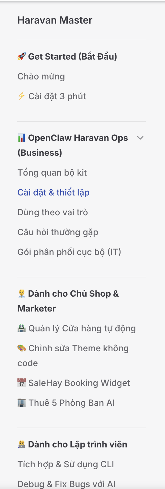

# OpenClaw Haravan Ops — Hướng dẫn cài đặt (lean)

Phân phối gọn cho **chủ shop / vận hành**: một MCP server nghiệp vụ, ít tool, kết quả dễ đọc.

## Yêu cầu

- Node.js 20+
- Shop Haravan + token API (`HARAVAN_SHOP`, `HARAVAN_TOKEN`)

## Biến môi trường (chuẩn)

| Biến | Mô tả |
|------|--------|
| `HARAVAN_SHOP` | Domain shop, ví dụ `ten-shop.myharavan.com` |
| `HARAVAN_TOKEN` | Bearer token (OAuth hoặc private app) |

## Cài và build

Từ thư mục repo:

```bash
npm install
npm run build --workspace @haravan-master/core
npm run build --workspace @haravan-master/openclaw-haravan-ops-mcp
```

## OpenClaw / MCP client

Thêm server stdio trỏ tới `node` và file đã build, ví dụ:

```json
{
  "mcpServers": {
    "openclaw-haravan-ops": {
      "command": "node",
      "args": ["/đường/dẫn/tới/repo/apps/openclaw-haravan-ops-mcp/dist/index.js"],
      "env": {
        "HARAVAN_SHOP": "your-shop.myharavan.com",
        "HARAVAN_TOKEN": "your-token"
      }
    }
  }
}
```

## Kiểm tra nhanh

```bash
npm run doctor-openclaw
```

## Skill (prompt hệ thống)

Xem skill **openclaw-haravan-ops** trong repo (file `skills/openclaw-haravan-ops/SKILL.md`) và thư mục `packs/`. Bản đọc trên web: [SKILL.md trên GitHub](https://github.com/tody-agent/haravan-master-ecosystem/blob/main/skills/openclaw-haravan-ops/SKILL.md).

## Tài liệu liên quan

- [playbook-tool-matrix.md](./playbook-tool-matrix.md) — ánh xạ use case ↔ tool
- [safety-disclaimers.md](./safety-disclaimers.md) — thuế, ghi dữ liệu
- [scheduler-adapters.md](./scheduler-adapters.md) — chạy định kỳ bên ngoài MCP
