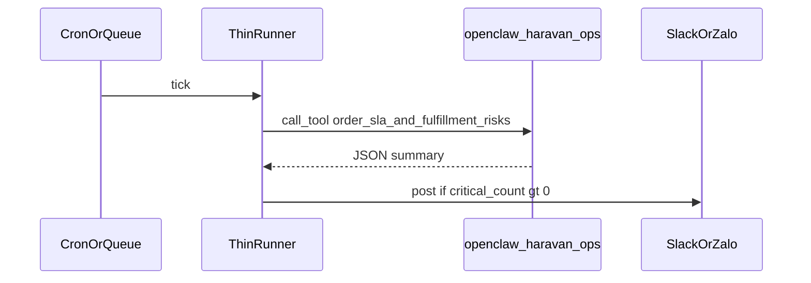

# Lịch chạy định kỳ (tách khỏi MCP)

MCP `openclaw-haravan-ops` chạy theo **request** (OpenClaw / client). Các use case trong [playbook ideas](/playbook-ideas) gợi ý cron (`*/5`, `0 22`…) — triển khai ở **lớp ngoài**.

## Nguyên tắc

1. **Cùng contract**: job bên ngoài gọi đúng tool MCP (hoặc bọc CLI tương đương sau này), không fork logic nghiệp vụ.
2. **Không cần mở OpenClaw UI**: có thể dùng subprocess `node dist/index.js` với JSON-RPC MCP qua stdio (phức tạp) hoặc **agent nhỏ** (n8n HTTP → service gọi `@haravan-master/core` trực tiếp — chỉ khi đồng bộ version).
3. **Cảnh báo**: Slack / Zalo / email là **adapter** gửi **text** đã tổng hợp từ output tool; phase 1 không bắt buộc trong repo.

## Mẫu luồng

## Gợi ý công cụ

- **cron** + script Node gọi thư viện core (copy logic từ `apps/openclaw-haravan-ops-mcp/src/ops-tools/*`) — tránh phụ thuộc MCP stdio.
- **n8n / Windmill / Trigger.dev**: schedule → HTTP internal → chạy workflow TypeScript.
- **OpenClaw** (nếu hỗ trợ scheduled task): cấu hình theo tài liệu OpenClaw, trỏ tới cùng server MCP.

## Ưu tiên tool theo playbook

| Tần suất gợi ý | Tool |
|----------------|------|
| Thường xuyên | `order_sla_and_fulfillment_risks`, `inventory_oversell_and_anomalies` |
| Hàng ngày | `daily_business_snapshot`, `end_of_day_reconciliation` |
| Hàng tuần | `weekly_ops_audit`, `slow_mover_and_restock_advisor` |
| Hàng tháng | `tax_compliance_snapshot`, `monthly_pl_estimate` |

Chi tiết mapping: [playbook-tool-matrix.md](./playbook-tool-matrix.md).
