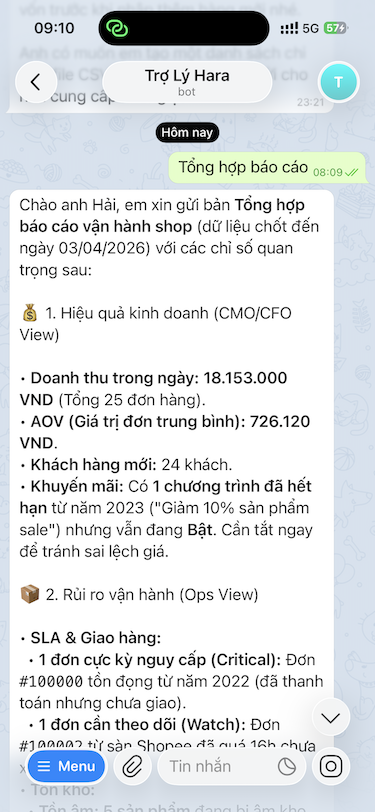
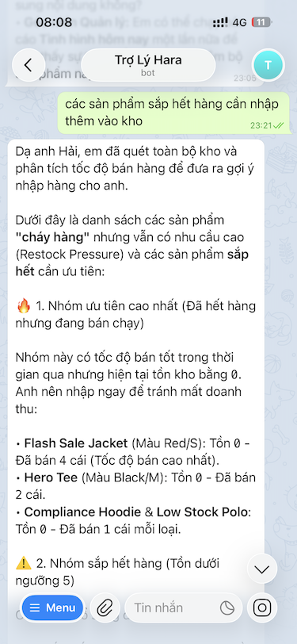
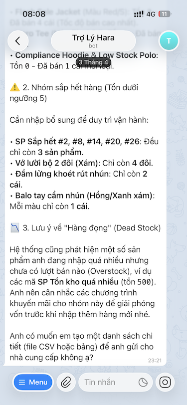
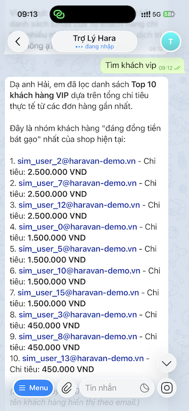
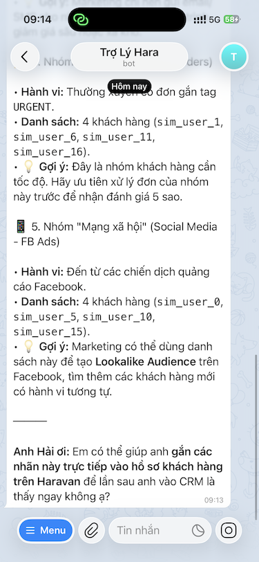

# Năng lực & use case của bộ kit theo vai trò trách nhiệm

> Đây là bản tổng hợp đầy đủ để nhìn bộ kit như một **hệ thống trợ lý vận hành cho doanh nghiệp** chứ không chỉ là một danh sách tool. Nếu nói ngắn gọn: `Haravan Master` là lớp **full MCP + full CRUD + deep operations**, còn `OpenClaw Haravan Ops` là lớp **lean, role-first, hỏi việc hằng ngày bằng ngôn ngữ business**.

## 1. Bộ kit này thực chất gồm 2 lớp

| Lớp | Bản chất | Phù hợp nhất khi | Điểm mạnh |
|-----|----------|------------------|-----------|
| **Haravan Master full** | Bộ công cụ đầy đủ với khoảng `33 tools`, có thể đi sâu vào products, orders, customers, themes, assets, webhooks, fulfillment, inventory | Bạn cần làm việc sâu, seed demo, build workflow, tra cứu kỹ thuật, hoặc thao tác ghi dữ liệu thật | Bao phủ rộng, có thể đọc và ghi, tốt cho Dev/IT, CS sâu, demo, automation |
| **OpenClaw Haravan Ops lean** | Bộ `composite tools` theo mục tiêu nghiệp vụ: một tool gần với một câu hỏi business | Bạn muốn hỏi nhanh kiểu “hôm nay thế nào”, “đơn nào rủi ro”, “SKU nào sắp hết”, “khách nào giá trị cao” | Dễ dùng, ít nhiễu, an toàn hơn, ưu tiên read-only, rất hợp chủ shop và vận hành |

### Cách hiểu đơn giản

- **Full MCP** là tầng máy móc chi tiết: đọc và thao tác từng thực thể trong shop.
- **OpenClaw** là tầng “đóng gói nghiệp vụ”: gom nhiều bước phân tích thành một câu hỏi dễ hỏi, dễ hiểu, dễ ra quyết định.
- **Skill theo phòng ban** là tầng “vai trò”: biến AI thành CEO Advisor, COO, CMO, CS, CTO tùy ngữ cảnh.

## 2. Giá trị cốt lõi theo góc nhìn doanh nghiệp

### A. Ra quyết định nhanh hơn

- Chủ shop không cần tự kéo nhiều màn hình admin để ghép doanh thu, đơn, tồn, khách.
- AI biến dữ liệu thô thành `executive summary`, cảnh báo và đề xuất hành động.

### B. Vận hành nhất quán hơn

- Các câu hỏi lặp lại mỗi ngày như báo cáo sáng, đơn chậm, low stock, khách VIP được chuẩn hóa thành playbook.
- Đội ngũ mới vào vẫn có thể dùng prompt theo vai trò thay vì học thuộc toàn bộ Haravan admin.

### C. An toàn hơn khi dùng AI

- Lean lane mặc định **đọc trước, ghi sau**.
- Các thao tác nhạy cảm như tạo theme draft hoặc chỉnh dữ liệu cần xác nhận rõ.
- Các báo cáo thuế, P&L được đóng khung là **ước tính hỗ trợ quyết định**, không thay kế toán.

### D. Demo và enablement tốt hơn

- Full MCP có thể seed dữ liệu demo thật để tạo tình huống business có chủ đích.
- OpenClaw biến dữ liệu đó thành câu chuyện dễ trình bày cho CEO, vận hành, marketing, CS.

## 3. Bản đồ năng lực theo vai trò

## Chủ shop / CEO / Founder

**Trách nhiệm chính:** nhìn toàn cục, phát hiện bất thường, ưu tiên việc nào phải xử lý ngay.

**Năng lực nổi bật của bộ kit:**

- Báo cáo nhanh theo ngày với `daily_business_snapshot`
- Audit theo tuần với `weekly_ops_audit`
- Ước tính P&L tháng với `monthly_pl_estimate`
- Dự báo rủi ro về thuế `tax_compliance_snapshot`
- Giám sát bất thường về giá bán `pricing_anomaly_scan`
- Tóm tắt rủi ro fulfillment, tồn kho, giá sai, khuyến mãi

**Use cases tiêu biểu:**

1. **Morning pulse trước giờ làm**
   - Hỏi: “Cho tôi báo cáo nhanh hôm nay của shop.”
   - Kết quả mong đợi: doanh thu, số đơn, đơn cần chú ý, top sản phẩm, một vài risk cần chốt ngay.

2. **Ra quyết định cuối tuần**
   - Hỏi: “Chạy weekly audit cho tôi, nói rõ 3 rủi ro lớn nhất.”
   - Kết quả: một bản tóm tắt điều hành, không cần đọc dữ liệu thô.

3. **Kiểm tra sức khỏe tháng**
   - Hỏi: “Ước tính P&L tháng này và kiểm tra rủi ro thuế/hoá đơn cần phòng bị.”
   - Kết quả: số liệu thô để định hướng, có disclaimer rõ.

4. **Phát hiện anomaly & lỗi vận hành**
   - Hỏi: “Có gì bất thường về giá bán (pricing anomaly) hay sản phẩm không tuân thủ (product compliance) không?”
   - Kết quả: sản phẩm giá 0, thay đổi giá bất thường, sản phẩm lỗi hiển thị.

::: details Thẩm định hình ảnh: Báo cáo vận hành từ góc nhìn CEO (Mobile)

*Giao diện Trợ Lý Hara trên Telegram đang tổng hợp báo cáo doanh thu, AOV và các rủi ro SLA cực kỳ nguy cấp cho lãnh đạo.*
:::

**Lớp công cụ nên dùng:**

- `OpenClaw lean` cho nhịp hỏi đáp hằng ngày
- `Haravan Master full` khi CEO muốn drill-down sâu tới từng order, product hoặc customer

**Output phù hợp nhất:**

- Executive summary
- Wins / risks / next actions
- Không quá nhiều bảng thô

---

## COO / Vận hành / Kho / Fulfillment

**Trách nhiệm chính:** giữ cho đơn chạy đúng SLA, kho không cháy hàng, không oversell, không để đơn treo.

**Năng lực nổi bật của bộ kit:**

- Về đơn hàng chuẩn bị trễ: `order_sla_and_fulfillment_risks`, `find_unfulfilled_orders`, `find_orders_needing_attention`
- Về Tồn kho nguy hiểm: `inventory_oversell_and_anomalies`, `find_low_stock_risks`
- Về Quản trị nhập hàng: `slow_mover_and_restock_advisor`, `sale_period_stock_forecast`
- Về Chốt số liệu kho: `end_of_day_reconciliation`, `product_compliance_scan`
- Trong bản full: `list_fulfillments`, `create_fulfillment`, `adjust_inventory`, `set_inventory`

**Use cases tiêu biểu:**

13. **Theo dõi đơn hàng cần chú ý (Attention Needed)**
   - Hỏi: “Liệt kê các đơn hàng cần tác động thủ công hoặc bị treo quá 24h.”
   - Kết quả: danh sách mã đơn, thời gian chờ, và lý do (vd: lỗi đồng bộ vận chuyển).

::: details Thẩm định hình ảnh: Quản trị tồn kho & Restock (Mobile)

*Trợ lý Hara tự động quét kho, phân loại "Cháy hàng" (Restock Pressure) và "Sắp hết" để COO ra quyết định nhập hàng ưu tiên.*
:::

::: details Thẩm định hình ảnh: Theo dõi "Hàng đọng" (Dead Stock)

*Hệ thống phát hiện hàng tồn kho quá nhiều nhưng không có lượt bán (Overstock) và đề xuất chạy khuyến mãi giải phóng vốn.*
:::

2. **Stockout radar & Chuẩn bị sale**
   - Hỏi: “SKU nào đang low stock hoặc dễ oversell? Gợi ý hàng hoá (stock forecast) cho đợt Mega Sale sắp tới.”
   - Kết quả: danh sách SKU dưới ngưỡng, tồn âm, ước tính số lượng cần nhập cho sale.

3. **Restock và slow movers**
   - Hỏi: “Gợi ý nhập hàng và chỉ ra mặt hàng chạy chậm trong 28 ngày.”
   - Kết quả: chỗ cần bơm hàng và chỗ nên giảm tồn (Restock Advisor).

4. **Đối soát cuối ngày**
   - Hỏi: “Chốt sổ cuối ngày giúp tôi.”
   - Kết quả: đối chiếu đơn, doanh thu, biến thể bán nhiều, các điểm lệch cần kiểm tra.

5. **Xử lý fulfillment thực thi**
   - Dùng bản full khi cần gắn tracking, kiểm fulfillment cụ thể, hoặc điều chỉnh tồn kho thật.

**Lớp công cụ nên dùng:**

- `OpenClaw lean` để phát hiện vấn đề và ưu tiên việc
- `Haravan Master full` để thao tác nghiệp vụ sâu, nhất là fulfillment và inventory write

**Điểm khác biệt lớn của kit:**

- Không chỉ báo “có vấn đề”, mà gom thành danh sách việc ưu tiên theo góc nhìn vận hành.

---

## Marketing / CRM / CMO

**Trách nhiệm chính:** tăng doanh thu từ khách hiện có, phát hiện tệp VIP, kích hoạt khách ngủ quên, kiểm tra sức khỏe khuyến mãi.

**Năng lực nổi bật của bộ kit:**

- `segment_high_value_customers` (Tính LTV / Value khách hàng)
- `find_reactivation_candidates`
- `promotion_health_check` (Giám sát mã giảm giá lỗi, kém hiệu quả)
- `sale_period_stock_forecast` (Hỗ trợ định hình sản phẩm đẩy flash sale)
- Trong bản full: phân tích abandoned checkout, tra khách, đếm tệp, cập nhật tag khách, hỗ trợ cross-sell / upsell

**Use cases tiêu biểu:**

13. **Xây dựng chương trình chăm sóc khách VIP**
   - Hỏi: “Cho tôi danh bạ email/số điện thoại của 10 khách hàng VIP nhất để chạy campaign riêng.”
   - Kết quả: danh sách thông tin liên hệ kèm LTV (Lifetime Value).

::: details Thẩm định hình ảnh: Phân khúc khách hàng VIP

*Trợ lý lọc danh sách Top 10 khách hàng "đáng đồng tiền bát gạo" nhất dựa trên tổng chi tiêu thực tế.*
:::

::: details Thẩm định hình ảnh: Gợi ý Marketing hành vi

*Không chỉ lọc khách, trợ lý còn gợi ý cách chạy quảng cáo Facebook Lookalike Audience từ tệp khách hiện có.*
:::

1. **Tìm khách VIP để chăm sóc**
   - Hỏi: “Phân nhóm khách giá trị cao và gợi ý cách chăm sóc.”
   - Kết quả: top khách hàng theo giá trị, gợi ý chăm sóc VIP, loyalty, private sale.

2. **Reactivation campaign**
   - Hỏi: “Khách nào có thể đưa vào chiến dịch kéo quay lại?”
   - Kết quả: danh sách khách dormant, ưu tiên theo mức chi tiêu.

3. **Kiểm tra sức khỏe khuyến mãi**
   - Hỏi: “Khuyến mãi đang chạy có gì cần lưu ý không?”
   - Kết quả: campaign yếu, trùng, ít dùng, hoặc có dấu hiệu không hiệu quả.

4. **Kịch bản nội dung cho CRM**
   - Dựa trên danh sách reactivation hoặc abandoned checkout, AI có thể gợi ý email/Zalo/message script.

5. **Tạo bundle / cross-sell**
   - Dùng bản full để đọc sâu products và đề xuất combo liên quan tới sản phẩm bán chạy.

**Lớp công cụ nên dùng:**

- `OpenClaw lean` cho insight marketing nhanh
- `Haravan Master full` khi cần đi sâu hơn vào customer operations, tagging, abandoned checkout handling

**Giá trị thực tế:**

- Marketing không chỉ nhìn data mà có ngay danh sách hành động: ai nên chăm, ai nên kéo lại, campaign nào nên dừng hoặc tăng lực.

---

## CS / Customer Support / Chăm sóc khách hàng

**Trách nhiệm chính:** tra cứu nhanh, xoa dịu khách, trả lời có ngữ cảnh, không để mất khách VIP.

**Năng lực nổi bật của bộ kit:**

- Trong bản full: `search_customers`, `get_customer`, `list_orders`, `get_order`, `update_customer`
- Ở lớp role skill: dựng `Customer 360`, soạn lời xin lỗi, script CSAT, guideline refund
- Ở lean lane: hỗ trợ gián tiếp qua order attention, VIP segmentation, fulfillment risk

**Use cases tiêu biểu:**

1. **Firefighting mode**
   - Hỏi: “Khách complain, check giúp tôi số điện thoại này.”
   - Kết quả: profile khách, đơn gần nhất, mức độ quan trọng, lý do chậm, script trả lời.

2. **Customer 360 trước khi gọi lại**
   - Hỏi: “Tìm khách theo số điện thoại ... và tóm tắt lịch sử mua.”
   - Kết quả: số lần mua, tổng chi tiêu, đơn gần nhất, ghi chú chăm sóc.

3. **Refund / appeasement workflow**
   - Hỏi: “Soạn quy trình hoàn tiền và tin nhắn gửi khách.”
   - Kết quả: checklist nội bộ + lời nhắn gửi khách.

4. **Giữ khách VIP đang bực**
   - Hỏi: “Khách VIP này đang giận vì giao trễ, xử lý giúp tôi.”
   - Kết quả: script có ngữ điệu phù hợp, không chỉ là dữ liệu vô cảm.

**Lớp công cụ nên dùng:**

- `Haravan Master full` là lớp mạnh nhất cho CS, vì cần tra customer/order chi tiết
- `OpenClaw lean` đóng vai trò tóm tắt bối cảnh vận hành và ưu tiên attention

**Điểm đáng giá nhất:**

- AI không chỉ “tra đơn”, mà chuyển từ dữ liệu sang ngôn ngữ giao tiếp phù hợp với khách.

---

## CTO / IT / SysAdmin / Agency Tech Lead

**Trách nhiệm chính:** đảm bảo kết nối, giám sát API, bảo vệ theme, quản lý webhook, hỗ trợ cài đặt và debug.

**Năng lực nổi bật của bộ kit:**

- CLI installer: `npx @haravan-master/cli install ...`
- Doctor commands: `npm run doctor-mcp`, `npm run doctor-openclaw`
- Full MCP tools cho themes, theme assets, webhooks
- Quy tắc rate-limit, error handling, local packaging
- Offline distribution package cho nội bộ

**Use cases tiêu biểu:**

1. **Cài nhanh cho business**
   - Một lệnh để cài bản full hoặc bản lean cho Claude/OpenClaw/Cursor.

2. **Doctor & debug kết nối**
   - Kiểm tra thiếu build, sai path `dist/index.js`, thiếu `HARAVAN_SHOP`, thiếu `HARAVAN_TOKEN`.

3. **Theme safety operations**
   - Audit theme risk, preview thay đổi, chỉ tạo draft khi có xác nhận.

4. **Webhook / integration monitoring**
   - Kiểm tra webhook active, lỗi 4xx/5xx, điều tra sync issue.

5. **Đóng gói nội bộ**
   - Build tarball `.tgz`, tài liệu offline, skill packs cho team không muốn phụ thuộc internet lúc cài.

6. **Demo enablement**
   - Seed data thật bằng full MCP rồi bàn giao cho sales, solution, trainer demo qua OpenClaw.

**Lớp công cụ nên dùng:**

- `Haravan Master full` là lớp chính
- `OpenClaw lean` dùng để bàn giao trải nghiệm business cho end user sau khi đã setup xong

---

## Sales / Presales / Demo / Enablement

**Trách nhiệm chính:** trình bày giá trị bộ kit, cho khách thấy kết quả nhanh, demo theo đúng pain point từng phòng ban.

**Năng lực nổi bật của bộ kit:**

- Seed demo data có chủ đích
- Có kịch bản demo 5 phút
- Có mapping theo vai trò: CEO, COO, marketing, theme safety
- Có thể chứng minh cả hai chuyện:
  - **full MCP ghi được dữ liệu thật**
  - **OpenClaw kể lại dữ liệu thành ngôn ngữ business**

**Use cases tiêu biểu:**

1. **Demo cho chủ shop**
   - Báo cáo sáng, attention orders, low stock, khách VIP.

2. **Demo cho đội vận hành**
   - SLA audit, tồn thấp, anomaly giá.

3. **Demo cho marketing**
   - VIP segmentation, reactivation, promotion health.

4. **Demo cho IT**
   - Build, doctor, package local, theme safety, webhook.

**Điểm chốt sale mạnh nhất:**

- Bộ kit không chỉ “kết nối AI với Haravan”.
- Bộ kit cho thấy **AI hiểu vai trò trong doanh nghiệp** và nói đúng ngôn ngữ của từng người.

## 4. Ma trận chọn đúng lớp công cụ theo vai trò

| Vai trò | Nhu cầu chính | Nên bắt đầu bằng | Khi nào nâng lên lớp full |
|--------|----------------|------------------|----------------------------|
| Chủ shop / CEO | Báo cáo, cảnh báo, quyết định | `OpenClaw lean` | Khi cần drill-down tới từng order/customer/product |
| COO / Kho / Ops | SLA, tồn, oversell, đối soát | `OpenClaw lean` | Khi cần fulfillment write, chỉnh inventory thật |
| Marketing / CRM | VIP, churn, campaign | `OpenClaw lean` | Khi cần customer ops sâu, tagging, abandoned flows |
| CS | Customer 360, xử lý khiếu nại | `Haravan Master full` | Gần như mặc định dùng full |
| CTO / IT | Setup, debug, webhook, theme | `Haravan Master full` | Luôn là lane chính |
| Sales / Demo | Storyline theo role | `OpenClaw lean` + seed từ full | Khi cần tạo dữ liệu demo hoặc chứng minh write flow |

## 5. Các nhóm use case lớn của bộ kit

### Nhóm 1: Điều hành hằng ngày

- Morning pulse
- Daily snapshot
- Weekly audit
- Monthly estimate
- End-of-day reconciliation

### Nhóm 2: Bảo toàn dòng tiền vận hành

- Đơn chưa paid
- Đơn chưa fulfill
- SLA risk
- Hủy đơn / treo đơn

### Nhóm 3: Bảo toàn hàng hóa và catalog

- Low stock
- Oversell
- Slow movers
- Giá 0đ
- `compare_at` sai
- Compliance gap

### Nhóm 4: Tăng trưởng từ tệp khách hàng

- VIP segmentation
- Dormant/reactivation candidates
- Campaign health
- Abandoned carts
- Cross-sell / upsell ideas

### Nhóm 5: An toàn hệ thống và giao diện

- Theme audit
- Theme draft preview
- Webhook health
- Rate-limit / doctor / install / packaging

### Nhóm 6: Demo, đào tạo và chuẩn hóa quy trình

- Seed dữ liệu demo
- Role-based prompt library
- Kịch bản 5 phút
- Tài liệu cài business vs IT

## 6. Prompt mẫu theo nhóm trách nhiệm

### Cho CEO / Chủ shop

```text
Cho tôi báo cáo nhanh hôm nay của shop.
```

```text
Ước tính P&L tháng này và nói rõ chỗ nào cần kế toán xác nhận.
```

### Cho COO / Vận hành

```text
Có đơn nào sắp lỡ SLA hoặc chưa giao không?
```

```text
SKU nào đang low stock hoặc dễ oversell?
```

### Cho Marketing / CRM

```text
Phân nhóm khách giá trị cao và gợi ý cách chăm sóc.
```

```text
Khách nào có thể đưa vào reactivation campaign?
```

### Cho CS

```text
Tìm khách theo số điện thoại này và tóm tắt lịch sử mua giúp tôi.
```

```text
Khách này đang bực vì giao trễ, soạn giúp tôi một lời xin lỗi phù hợp.
```

### Cho CTO / IT

```text
Health check hệ thống Haravan giúp tôi.
```

```text
Kiểm tra rủi ro theme hiện tại, chỉ audit trước.
```

## 7. Khuyến nghị triển khai thực tế

### Nếu team bạn là business-first

1. Cài `OpenClaw lean`
2. Dùng prompt theo vai trò
3. Chuẩn hóa thói quen hỏi mỗi sáng và cuối ngày
4. Chỉ nhờ IT nâng sang full khi cần thao tác sâu

### Nếu team bạn là ops-heavy hoặc agency

1. Dùng `Haravan Master full` làm nền
2. Seed demo / build workflow / kiểm thử
3. Bàn giao lớp `OpenClaw lean` cho end user
4. Giữ nguyên nguyên tắc read-first, confirm-write

### Nếu team bạn vừa business vừa IT

- Xem `Haravan Master full` là **engine room**
- Xem `OpenClaw` là **business cockpit**
- Xem `skills theo phòng ban` là **interface theo vai trò**

## 8. Kết luận

Điểm mạnh nhất của bộ kit không nằm ở số lượng tool, mà ở chỗ nó ghép được ba tầng rất khác nhau thành một trải nghiệm liền mạch:

1. **Tầng dữ liệu và thao tác thật** với Haravan
2. **Tầng nghiệp vụ** được đóng gói thành playbook dễ hỏi
3. **Tầng vai trò** để AI nói đúng ngôn ngữ của CEO, COO, CMO, CS hay CTO

Nếu chỉ cần một câu để mô tả với khách hàng hoặc nội bộ, có thể dùng:

> **Haravan Master + OpenClaw là bộ kit biến dữ liệu shop thành trợ lý vận hành theo vai trò: lãnh đạo xem nhanh để quyết định, vận hành xử lý việc tồn đọng, marketing khai thác tệp khách, CS trả lời có ngữ cảnh, còn IT giữ hệ thống an toàn và dễ triển khai.**

## Liên kết nên đọc tiếp

- [Trang tổng OpenClaw kit](/)
- [Hướng dẫn theo vai trò](/su-dung-theo-vai-tro)
- [Seed dữ liệu demo & kịch bản trình diễn](/demo-seed-va-kich-ban-demo)
- [Sử dụng theo vai trò](/su-dung-theo-vai-tro)
